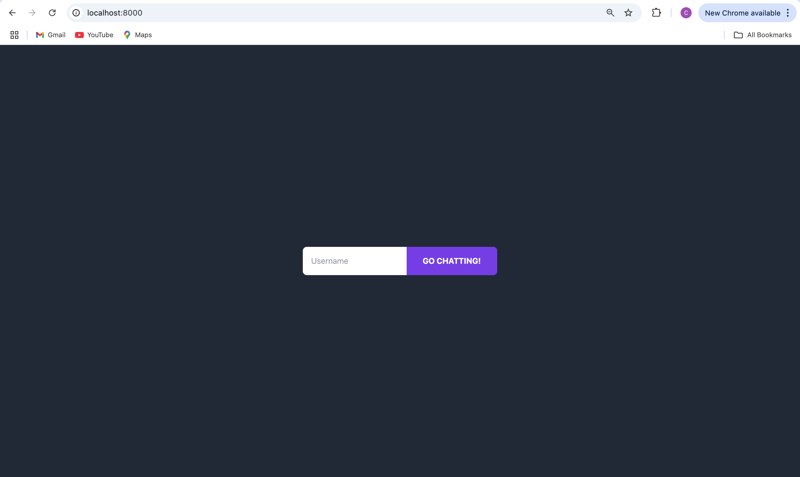
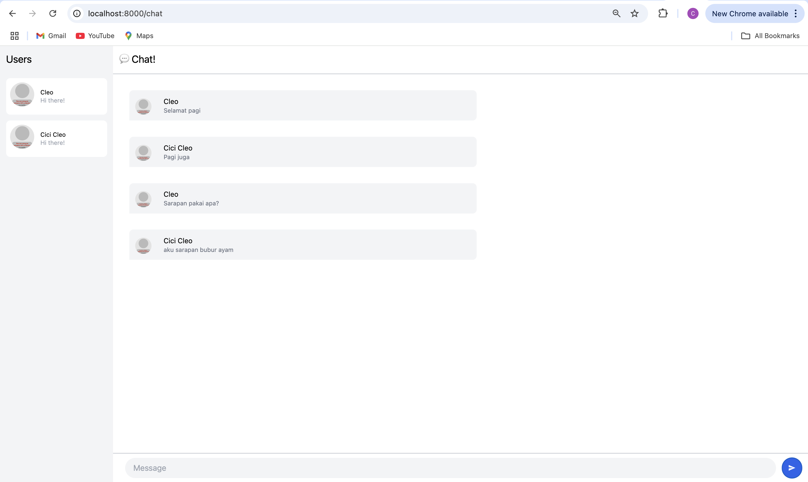
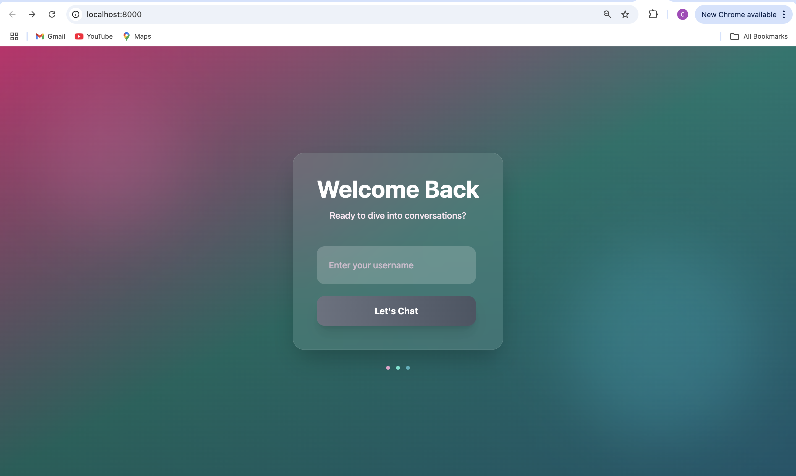
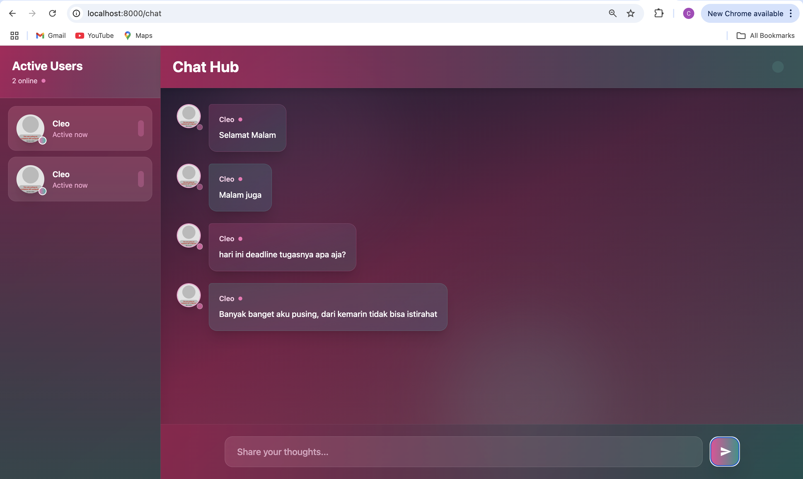

## 3.1 Original Code
- Ketika user membuka aplikasi, mereka akan diarahkan ke login yang sederhana. Terdapat form input untuk mengetikkan username serta button “GO CHATTING!”. Setelah user mengetikkan username, mereka akan diarahkan ke halaman ruang obrolan utama.

- Setelah masuk, user akan melihat halaman utama aplikasi chat. Di bagian kiri terdapat daftar user yang sedang online. Ketika lebih dari satu active user, seperti contoh antara "Cleo" dan "Cici Cleo", percakapan ditampilkan di ruang chat. Setiap pesan dilengkapi dengan nama pengguna dan isi pesan, yang memudahkan pengguna mengikuti alur percakapan. Daftar pengguna aktif di panel kiri juga menampilkan semua pengguna yang sedang terhubung dengan server.

## 3.2 Be Creative
- Tampilan antarmuka aplikasi yang kamu buat sangat modern dan estetik, memadukan elemen visual berbasis gradien warna, efek blur, serta animasi untuk memberikan kesan dinamis dan hidup. Halaman pertama adalah halaman Login, yang menyambut pengguna dengan latar belakang berlapis gradien dari warna pink, biru, dan cyan yang dibubuhi elemen dekoratif berupa lingkaran blur berwarna pastel. Di tengah layar terdapat sebuah kartu transparan dengan teks sambutan "Welcome Back" dan deskripsi singkat yang mengajak pengguna bergabung ke dalam percakapan. Form login terdiri dari satu input untuk memasukkan username, dan tombol “Let’s Chat” yang akan aktif ketika input telah diisi. Tombol ini juga menggunakan gradien warna dan efek interaktif seperti transformasi skala saat hover. Elemen animasi tambahan berupa tiga titik kecil yang berdenyut (pulse) di bagian bawah memberikan kesan bahwa aplikasi selalu aktif dan responsif.
- Setelah pengguna memasukkan nama dan mengklik tombol, mereka diarahkan ke halaman Chat. Halaman ini terbagi menjadi dua bagian utama. Di sisi kiri terdapat panel daftar pengguna yang sedang aktif, yang menampilkan avatar, nama, dan status "Active now". Avatar ini diambil dari layanan DiceBear dan dihasilkan secara unik berdasarkan nama pengguna. Setiap entri pengguna juga disertai animasi dan efek skala saat di-hover. Di bagian kanan, terdapat area utama untuk percakapan. Di bagian atasnya terdapat judul "Chat Hub" dan indikator koneksi berupa tiga titik warna-warni yang beranimasi. Pesan-pesan yang dikirim dan diterima ditampilkan dalam bentuk bubble chat dengan warna gradien yang berganti-ganti sesuai urutan. Jika isi pesan berakhiran ".gif", maka akan ditampilkan sebagai gambar, bukan teks biasa. Di bagian bawah terdapat form pengiriman pesan dengan input teks dan tombol kirim yang berbentuk panah. Seluruh desain halaman ini memperkuat nuansa profesional dan futuristik, sambil tetap menjaga kenyamanan visual bagi pengguna.

